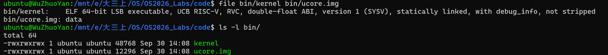
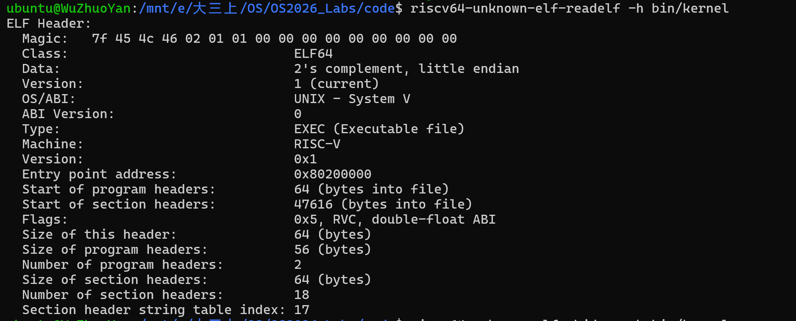
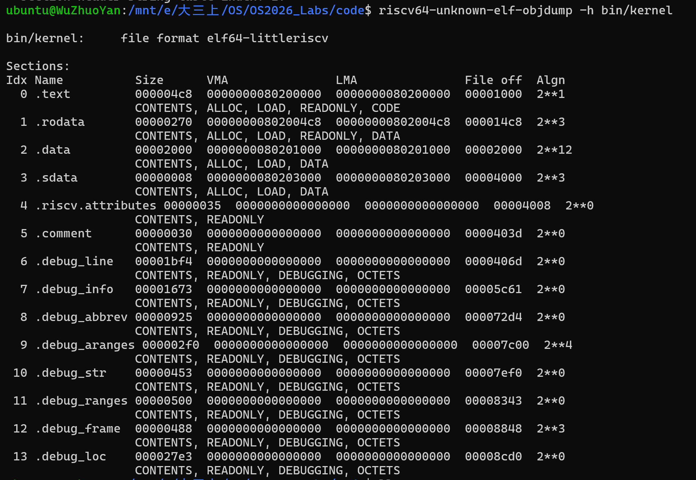
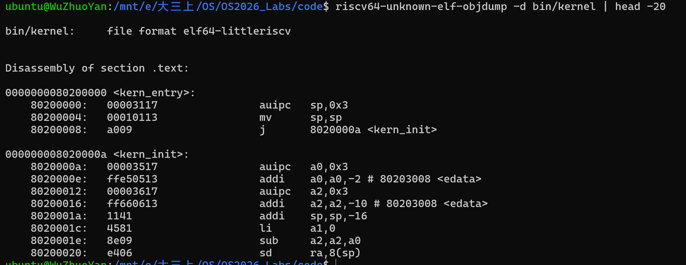
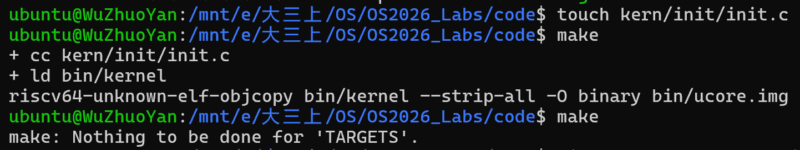
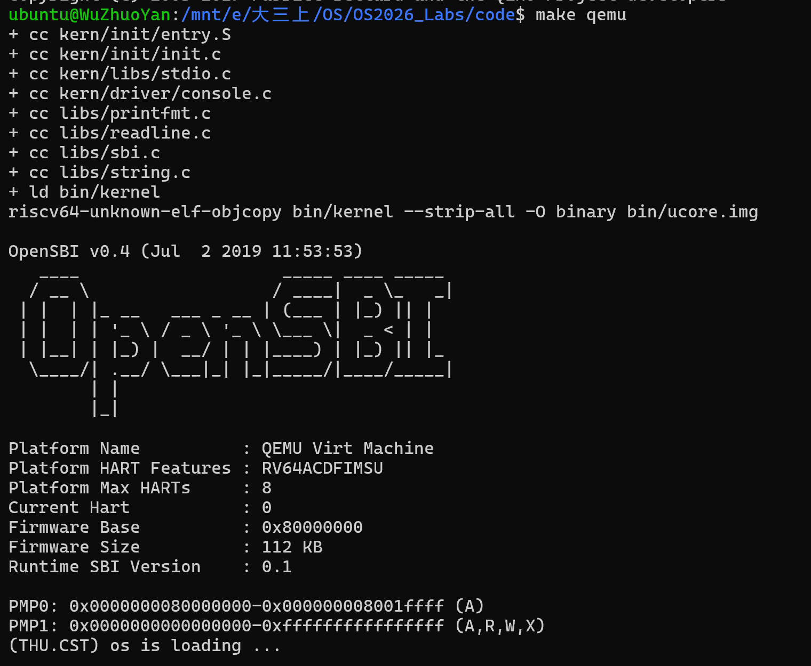
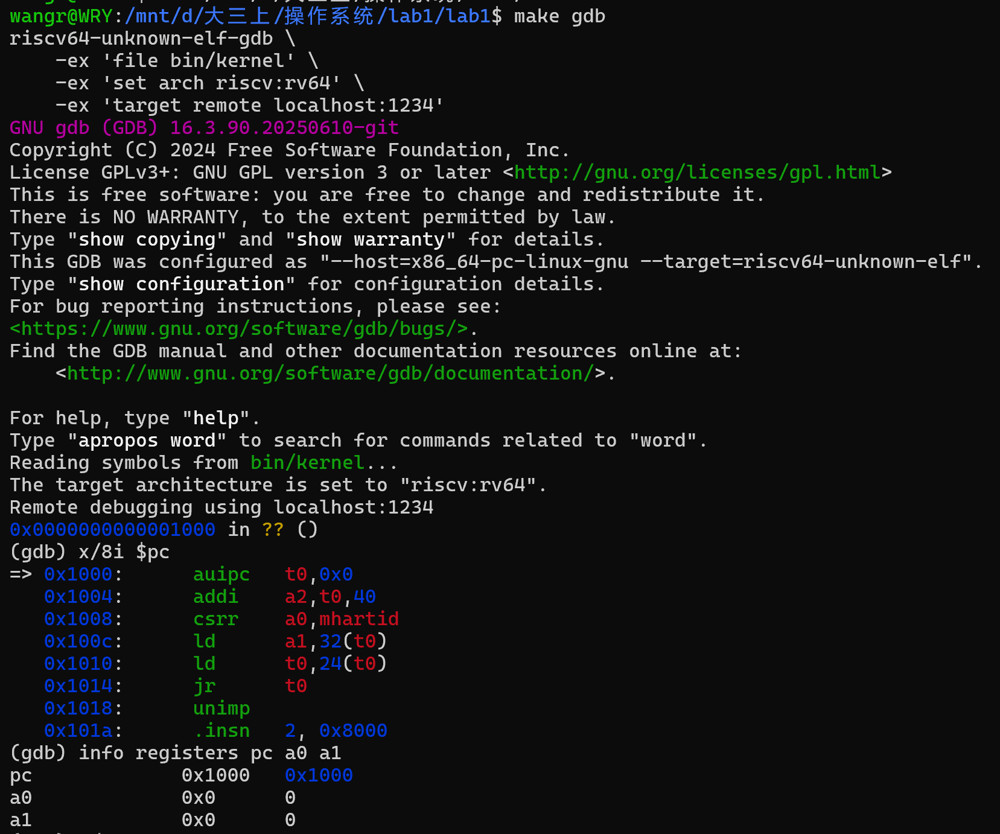
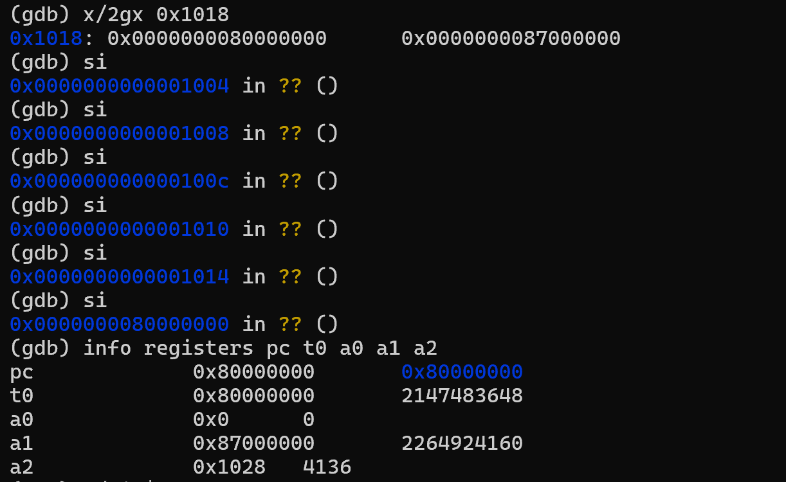
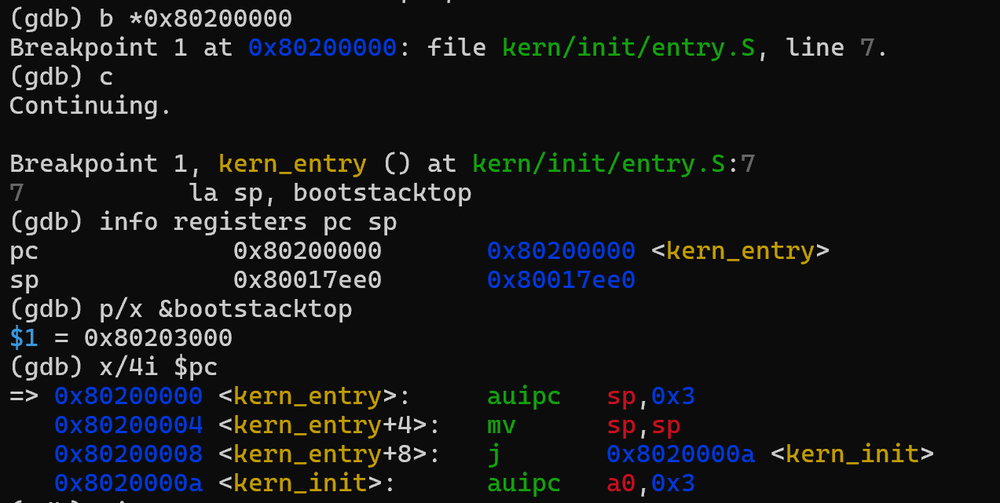
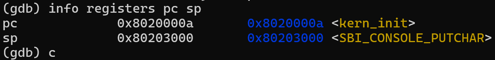

# 操作系统实验报告

## 实验基本信息

| 项目 | 内容 |
|------|------|
| **实验名称** | lab1: 比麻雀更小的麻雀 |
| **小组成员** | 2411333-吴卓彦、2413497-姚嘉乐、2410690-王睿瑜 |
| **完成日期** | 2026-10-07 |

### 小组分工

**练习分工**

| 成员 | 负责的练习/模块 |
|------|----------------|
| 2411333-吴卓彦 | 构建与整合：Makefile、交叉编译工具链、objcopy、ELF 与 BIN 格式的分析与取证；建立小组 git 仓库；复核练习 2 |
| 2413497-姚嘉乐 | 输出链路：ecall 与 SBI 调用约定、内联汇编 sbi_call、sbi.c → console.c → stdio.c → printfmt.c 的分层封装 |
| 2410690-王睿瑜 | 启动流程：练习 1（entry.S 入口操作）、练习 2（GDB 跟踪启动流程）、kernel.ld 内存布局与 edata/end 符号 |

**实验报告分工**

| 成员 | 负责的报告章节 |
|------|----------------|
| 2411333-吴卓彦 | 报告骨架与最终整合；三“实验整体逻辑分析”3.1、3.2；四“功能模块：构建系统”；六 知识点第 4-6 条|
| 2413497-姚嘉乐 | 六 知识点第 1–3 条（ecall、SBI 调用约定、分层封装） |
| 2410690-王睿瑜 | 三“实验整体逻辑分析”3.3；四 练习 1、练习 2；五 GDB 调试截图 |


---

## 一、实验目的

<!-- 说明本次实验的主要目标和预期成果 -->

本实验的主要目的是：

1. 理解 QEMU 模拟的 RISC-V 计算机从加电到内核开始执行的启动流程（0x1000 → OpenSBI → 0x80200000），以及 OpenSBI 作为 bootloader 的作用
2. 学会使用链接脚本描述内核的内存布局，并通过交叉编译生成可执行文件和内核镜像
3. 理解内核如何通过 ecall 调用 OpenSBI 提供的服务，并逐层封装出格式化输出函数 cprintf，用于以后的调试
4. 掌握使用 GDB 远程调试 QEMU 的方法，验证启动流程中的关键地址和指令

---

## 二、实验环境

| 成员 | AI 编程工具 | 底层模型 | 备注 |
|------|------------|---------|------|
| 2411333-吴卓彦 | Claude Code（Claude 桌面应用） | Opus5.5 | 无 |
| 2413497-姚嘉乐 | codex（vscode插件） | gpt6astra| 无|
| 2410690-王睿瑜 | Claude Code（终端agent） | gpt 6.1sol | 无 |

**说明：**
- **AI 编程工具**：指具体使用的终端工具、编辑器插件、桌面应用或浏览器界面
- **底层模型**：指该工具使用的大语言模型及版本

---

## 三、实验整体逻辑分析

### 3.1 本章节的逻辑主线

本章围绕“构建一个最小的可执行内核”展开：让一段我们自己编写的代码在 QEMU 模拟的 RISC-V 计算机上被正确装入、获得控制权，并能输出一行文字，为后续实验提供可以运行和调试的基础。它要解决三个问题：内核如何被编译成机器能执行的镜像，机器启动后如何把控制权交给内核，以及内核在没有任何库的情况下如何输出信息。

### 3.2 功能的逐步实现

1. 首先是构建：交叉编译工具链把源码编译成 .o，链接器按 kernel.ld 把内核的入口和各节固定在 0x80200000 起的地址上，再由 objcopy 生成镜像 ucore.img。这是一切的前提，没有放在正确地址上的镜像，后面的启动无从谈起。
2. 接着是启动：QEMU 把镜像装入 0x80200000，CPU 从 0x1000 开始执行，经过 OpenSBI 初始化后跳到内核入口 kern_entry。entry.S 先设置内核栈，再跳到 C 函数 kern_init，因为 C 代码必须依赖栈才能运行。
3. 然后是初始化：kern_init 利用链接脚本提供的 edata/end 符号把 .bss 清零，保证全局变量的初值正确。
4. 最后是输出：内核运行在 S 模式，不能直接操作硬件，于是通过 ecall 请求 M 模式的 OpenSBI 输出字符，再在此基础上逐层封装出 cprintf，打印出 “(THU.CST) os is loading ...” 并进入死循环，形成完整的闭环。

### 3.3 启动过程的补充说明

本实验涉及的启动过程依次为：QEMU 启动虚拟机后，CPU 先从复位地址 0x1000 执行引导代码，然后进入 OpenSBI 固件；OpenSBI 完成必要的初始化，再把执行权交给位于 0x80200000 的内核。内核获得控制权后首先执行 entry.S 中的入口代码，建立内核栈，再跳转至 kern_init。本部分围绕入口操作及其 GDB 验证过程展开。
使用仓库原有代码和 Makefile 执行 make qemu，内核能够正常启动，并输出 (THU.CST) os is loading ...。原 Makefile 使用 -device loader,file=$(UCOREIMG),addr=0x80200000，由 QEMU 将内核镜像装入指定内存地址；OpenSBI 完成初始化后将控制权交给内核。

---

## 四、实验内容与实现

### 练习：[练习1：理解内核启动中的程序入口操作]

**负责人：** [2410690-王睿瑜]

#### 问题

阅读 kern/init/entry.S内容代码，结合操作系统内核启动流程，说明指令 la sp, bootstacktop 完成了什么操作，目的是什么？ tail kern_init 完成了什么操作，目的是什么？

#### 解答

#### 1. la sp, bootstacktop 完成了什么操作？目的是什么？
该指令将bootstacktop的地址写入栈指针寄存器sp。entry.S使用.space KSTACKSIZE 为内核预留了栈空间，bootstacktop 表示该空间的高地址边界。栈向低地址增长，因此以高地址边界作为初始栈顶。la只负责设置栈指针，栈空间已由.space KSTACKSIZE预留。
该操作为随后执行的C函数建立内核栈。进入kern_entry时,sp尚未指向预留的内核栈，必须在执行kern_init前完成设置。GDB 单步显示，sp从 0x80017ee0变为0x80203000，与bootstacktop的地址一致。本实验预留的栈大小是2 × 4096 = 8192字节。
#### 2. tail kern_init 完成了什么操作？目的是什么？
这条指令跳转到 kern_init，使内核进入 C 语言初始化函数。tail 表示尾调用，不保存返回 kern_entry 的地址；kern_init 被声明为不返回，并最终进入无限循环，因此无需返回入口汇编。
本次 GDB 反汇编显示，该指令对应 j 0x8020000a <kern_init>。单步执行后，PC 到达 0x8020000a，sp 保持为 0x80203000。由此可见，入口代码先建立内核栈，再将执行权交给 C 函数。
#### 3. 入口地址和链接符号的理解
tools/kernel.ld 通过 ENTRY(kern_entry) 指定 ELF 内核入口，并以 0x80200000 为基址安排内核各段。GDB 在 0x80200000 <kern_entry> 命中断点，验证了入口地址。bootstacktop 在 entry.S 中定义，其最终地址则由链接后的内存布局确定。
链接脚本还在 .sdata 后、.bss 后分别定义 edata 和 end。kern_init 使用这两个地址执行 memset(edata, 0, end - edata)，用于清零两者之间的区域。前次 GDB 检查中，两者的地址均为 0x80203008，差值为零，因此该构建没有实际需要清零的字节。它们是链接器定义的边界符号，而非用于存储数据的普通 C 变量。


### 练习：[练习2： 使用GDB验证启动流程]

**负责人：** [2410690-王睿瑜]

#### 问题

为了熟悉使用 QEMU 和 GDB 的调试方法，请使用 GDB 跟踪 QEMU 模拟的 RISC-V 从加电开始，直到执行内核第一条指令（跳转到 0x80200000）的整个过程。通过调试，请思考并回答：RISC-V 硬件加电后最初执行的几条指令位于什么地址？它们主要完成了哪些功能？请在报告中简要记录你的调试过程、观察结果和问题的答案。

#### 解答

#### 1. 调试过程与观察结果
在两个终端分别运行 make debug 和 make gdb。前者使 QEMU 在启动后暂停并等待 GDB 连接；后者加载 bin/kernel 的调试符号并连接 QEMU。连接后 GDB 显示 0x0000000000001000 in ?? ()，说明此时 PC 在 0x1000，尚未进入内核。?? 表示当前加载的内核符号未给出该处代码的函数名。
执行 x/8i $pc，得到 0x1000 开始的指令如下：

0x1000: auipc t0,0x0
0x1004: addi  a2,t0,40
0x1008: csrr  a0,mhartid
0x100c: ld    a1,32(t0)
0x1010: ld    t0,24(t0)
0x1014: jr    t0

x/2gx 0x1018 显示 0x1018 处存放 0x80000000，0x1020 处存放 0x87000000。其中，auipc 以当前 PC 为基准计算地址，使 t0 = 0x1000；随后 a2 被设为 0x1028，a0 读取当前 hart 编号，a1 取出 0x87000000，t0 取出下一阶段地址 0x80000000。jr t0 完成跳转。连续执行六次 si 后，PC 依次经过 0x1004、0x1008、0x100c、0x1010、0x1014，最终到达 0x80000000；此时 a0 = 0、a1 = 0x87000000、a2 = 0x1028。寄存器数值与指令及内存内容相符。0x1018 起的内容作为启动数据读取，实际执行流在 0x1014 跳走。
到达 0x80000000 后，使用 x/8i $pc 查看固件入口，可见代码先将 a0、a1、a2 暂存到 s0、s1、s2，随后执行 jal 0x800006a0。由此可见程序已进入固件代码。本次未逐条跟踪后续所有固件指令。接着执行 b *0x80200000 和 c，GDB 停在 kern_entry，PC 为 0x80200000。QEMU 同时输出 Firmware Base = 0x80000000、Domain0 Next Address = 0x80200000、Domain0 Next Mode = S-mode。
在内核入口，info registers pc sp 显示 sp = 0x80017ee0，p/x &bootstacktop 显示 0x80203000。x/4i $pc 的前三条指令是：

0x80200000 <kern_entry>:   auipc sp,0x3
0x80200004 <kern_entry+4>: mv    sp,sp
0x80200008 <kern_entry+8>: j     0x8020000a <kern_init>

前两条机器指令对应本次构建中的 la sp, bootstacktop。执行两次 si 后，PC 为 0x80200008，sp 变为 0x80203000；再执行一次 si，PC 到达 0x8020000a <kern_init>，sp 保持不变。最后在 GDB 中输入 c，运行 make debug 的终端出现 (THU.CST) os is loading ...，表明内核初始化函数已执行到输出语句。

#### 2. 对练习问题的回答
RISC-V 虚拟 CPU 启动后首先执行的代码位于 0x1000。通过反汇编和单步验证，该处的前六条指令主要用于准备 hart 编号等启动参数，从内存取出下一阶段入口地址，并通过 jr t0 跳到 0x80000000。该地址也是本次 OpenSBI 输出的固件基址。固件完成初始化后，按照 QEMU/OpenSBI 显示的下一阶段地址和模式，把控制权交给 S 模式内核的 0x80200000；GDB 在 kern_entry 命中断点，验证了这一交接结果。因此，本次启动的关键地址依次是 0x1000 → 0x80000000 → 0x80200000。
上述调试记录验证了固件向内核移交控制权的过程。仓库原 Makefile 使用 -device loader 装载内核镜像，可以正常启动内核，无需修改原有启动配置。

### 功能模块：构建系统

**负责人：** [2411333-吴卓彦]

#### 模块功能描述

**涉及的文件：**

```text
Makefile            # 构建规则：编译、链接、生成镜像、启动 QEMU
tools/function.mk   # 批量生成编译规则的辅助函数
tools/kernel.ld     # 链接脚本：规定入口和各节的运行地址
```

本模块不修改代码，而是分析内核从源代码到在QEMU中运行的构建过程，并用工具输出取证。

**功能说明：**

##### 1. 交叉编译工具链

本实验使用 SiFive 提供的预编译工具链 riscv64-unknown-elf-（gcc 10.2.0，安装在 WSL 的 /opt/riscv）。前缀各段的含义是：riscv64 表示产物运行在 64 位 RISC-V CPU 上；unknown 表示不指定厂商；elf 表示目标平台没有操作系统（裸机），产物采用 ELF 格式。我们的电脑是 x86 架构，自带的 gcc 只能生成 x86 指令，而 RISC-V 的指令集完全不同，所以必须在 x86 机器上用这套工具生成 RISC-V 程序，这种做法叫**交叉编译**。gcc、ld、objcopy、objdump、gdb 都带同一个前缀，在 Makefile 中统一由变量 GCCPREFIX 指定。

##### 2. 构建流水线

实验源码共 8 个文件（7 个 .c，1 个 .S）。gcc 把每个源文件单独编译成目标文件（.o），共 8 个。链接器 ld 按照 tools/kernel.ld 的规则把 8 个 .o 合并成一个程序，给每个节分配运行地址，代码从 0x80200000 开始，最终生成 ELF 格式的 bin/kernel。objcopy 去掉 ELF 头、符号表和调试信息，只保留要装进内存的代码和数据，得到裸二进制文件 ucore.img，大小从 48768 字节变为 12296 字节。最后 QEMU 在开机前把 ucore.img 复制到内存 0x80200000，OpenSBI 完成初始化后跳到这个地址，开始执行内核。

生成镜像的规则位于 Makefile 第 133–134 行：

```makefile
$(UCOREIMG): $(kernel)
	$(OBJCOPY) $(kernel) --strip-all -O binary $@
```

冒号左边的 \$(UCOREIMG)（即 bin/ucore.img）是目标，右边的 \$(kernel)（即 bin/kernel）是依赖，下一行是生成目标的命令，\$@ 代表本条规则的目标。--strip-all 去掉符号表和调试信息，-O binary 把输出格式指定为裸二进制。

##### 3. 构建产物取证

（1）文件格式与大小。file 显示 bin/kernel 是 “ELF 64-bit LSB executable, UCB RISC-V … statically linked, with debug_info, not stripped”，而 bin/ucore.img 只是 “data”，因为裸二进制没有任何文件头可供识别。ls -l 显示 kernel 为 48768 字节，ucore.img 为 12296 字节。



（2）入口地址。readelf -h 显示 Entry point address 为 0x80200000，与 kernel.ld 中的 ENTRY(kern_entry) 和 BASE_ADDRESS 一致。



（3）节的布局。objdump -h 显示 .text 从 0x80200000 开始，其后依次是 .rodata（0x802004c8）、.data（0x80201000，大小 0x2000，即 entry.S 中预留的 8KB 内核栈）、.sdata（0x80203000，大小 8 字节）。各节的 VMA（运行地址）与 LMA（装入地址）相同，因为本实验没有开启分页。kernel.ld 中的 `. = BASE_ADDRESS;` 把起始地址设为 0x80200000；kern/init 在链接顺序中排在最前（Makefile 第 102 行），entry.o 又是其中第一个文件，因此 kern_entry 位于 .text 的第一个字节。ucore.img 的内容正是 0x80200000 到 .sdata 结尾 0x80203008 这一段，0x3008 = 12296 字节，节与节之间的空隙以 0 填充；.bss 全为 0、在文件中没有内容，因此不包含在内。



（4）入口指令。objdump -d 反汇编得到 kern_entry 处的指令：

```text
80200000 <kern_entry>:  auipc sp,0x3
80200004:               mv    sp,sp
80200008:               j     8020000a <kern_init>
```

la sp, bootstacktop 是伪指令，由于一条 32 位指令装不下完整地址，汇编器把它展开为 auipc（PC 加上地址高 20 位，得到 0x80203000）和 addi（加上低 12 位，此处为 0，反汇编显示为 mv）。tail kern_init 也是伪指令，此处展开为一条不保存返回地址的 j 指令。该结果与练习 2 中 GDB 观察到的指令一致。



##### 4. 增量编译

make 通过比较**时间戳**决定要重做哪些步骤：如果目标文件比它依赖的文件旧，就重新生成。实验中先用 **touch** 更新 kern/init/init.c 的修改时间，再执行 **make**，输出只有三行：`cc kern/init/init.c` 只重新编译了 init.o，其余 7 个 .o 没有变化所以跳过；init.o 变了，依赖它的 bin/kernel 需要重新链接（`ld`）；kernel 变了，ucore.img 也要重新用 `objcopy` 生成。再执行一次 make 时，每个目标都比它的依赖新，make 提示 **Nothing to be done**。这样修改一个文件只需要重做受影响的部分，不用全部重新编译。

```text
$ touch kern/init/init.c
$ make
+ cc kern/init/init.c
+ ld bin/kernel
riscv64-unknown-elf-objcopy bin/kernel --strip-all -O binary bin/ucore.img
$ make
make: Nothing to be done for 'TARGETS'.
```



---

## 五、测试与验证


**测试截图：**

在 code 目录使用原版 Makefile 执行 make qemu，QEMU 启动后先输出 OpenSBI 信息，随后内核打印 (THU.CST) os is loading ... 并进入无限循环，说明内核被正确编译、装入并开始执行。












---

## 六、实验总结与收获

### 对操作系统的理解

1、ecall机制与系统调用陷入 对应 操作系统原理中的“通过陷入请求特权服务”知识

ecall 指令是 RISC-V 中用于实现受控的权限提升的关键指令。当在 U 模式（用户态）执行 ecall，会触发异常，从而陷入到 S 模式（内核态）。这是系统调用的底层机制。当在 S 模式（内核态）执行 ecall，会触发异常，从而陷入到 M 模式（机器态）。

本实验中，内核运行在 S 模式，OpenSBI 固件运行在 M 模式。内核需要输出字符时，通过 ecall 请求 OpenSBI 提供服务。ecall 会触发同步异常，使处理器转入相应的异常处理入口。lab1实验手册向我们初步展示了跨特权级调用的基本机制，介绍了ecall这个实现受控权限提示的关键指令。OS原理中系统调用的底层机制大概也是这样，只是目前实验只是内核态和机器态的转换，而不是用户态和内核态的转换。

2、SBI调用约定 对应 系统调用的调用格式，调用约定等知识

手册进一步介绍了，通过ecall调用SBI服务的调用约定，具体而言：

指定服务编号：将想要调用的 SBI 功能编号（例如，SBI_CONSOLE_PUTCHAR = 1）放入指定的寄存器（通常是 a7 或 x17）。
传递参数：根据 RISC-V 的函数调用约定（Calling Convention），将参数放入寄存器 a0, a1, a2（即 x10, x11, x12）。
执行调用：执行 ecall 指令。CPU 会 trap 到 M 模式，由 OpenSBI 固件处理请求。
获取返回值：处理完成后，OpenSBI 会将返回值放入 a0（x10）寄存器，然后返回。

约定体现了ABI的作用：调用双方不仅需要知道“调用什么功能”，还必须约定“参数放在哪里、如何返回结果、哪些寄存器需要保留”。这样即使双方分别由 C 和汇编实现，只要遵守同一套约定，就能正确交换信息。

3、输出函数的分层封装  对应 操作系统中的分层设计和设备抽象思想

实验手册中从 OpenSBI 的单字符输出服务出发，逐层构建出 cprintf。其中每一层都向上提供更方便的接口，并隐藏下一层的实现细节。

ecall ↔ 系统调用陷入与特权级转换；SBI 调用约定 ↔ ABI 与过程调用标准；分层输出封装 ↔ 分层设计与设备抽象；自实现 cprintf ↔ 运行时库与内核接口的关系。

4、ELF/BIN 与静态链接、绝对装入 对应 操作系统原理中程序的链接与装入

实验中 8 个 .o 由 ld 静态链接成 ELF 格式的 bin/kernel（file 显示 statically linked），kernel.ld 把运行地址固定为 0x80200000，objcopy 生成的 ucore.img 由 QEMU 原样复制到这个物理地址，VMA 与 LMA 相同。这对应原理课中的静态链接和绝对装入：地址在链接时就已确定，装入时不做任何修改。区别在于，原理课里由操作系统的装入程序读取可执行文件并分配内存，现代系统还会通过页表实现动态运行时装入；而本实验中内核本身就是第一个运行的程序，此时没有操作系统、也没有页表，只能由 QEMU 代替装入程序，因此只能采用最简单的绝对装入。到 lab2 开启页表后，内核的虚拟地址和物理地址将不再相同。

5、ELF 的节布局与内核栈 对应 操作系统原理中程序的内存映像（代码段、数据段、BSS 段、栈）

objdump -h 显示内核被分成若干节：.text 存放代码（标记为 READONLY、CODE），.rodata 存放只读常量（如要打印的字符串），.data 和 .sdata 存放有初值的全局变量，.bss 存放初值为 0 的全局变量。其中 .data 大小为 0x2000，正是 entry.S 用 .space KSTACKSIZE 预留的 8KB 内核栈；.bss 在文件中不占空间，只记录需要的大小。这对应原理课中进程的内存映像：一个程序在内存中由代码段、数据段、BSS 段、堆和栈组成。

二者的关系在于，原理课中这些区域由操作系统的装入程序负责建立：分配内存、把 BSS 清零、为进程准备好栈，并借助页表把代码段设为只读。而本实验中内核之下没有操作系统，这些工作只能由内核自己完成：entry.S 第一条指令就用 la sp, bootstacktop 设置栈，kern_init 第一件事就是用链接脚本提供的 edata 和 end 把 .bss 清零。另外，节上的 READONLY 只是 ELF 中的标记，本实验尚未开启页表，硬件并不会真正阻止对代码段的写入；内核也还没有堆，动态内存分配要到 lab2 实现物理内存管理后才有。

6、交叉编译与不依赖标准库的构建方式 对应 操作系统原理中源程序到可执行程序的处理过程，以及操作系统与应用程序的接口关系

原理课中，源程序要经过编译、汇编、链接才能成为可执行程序，普通应用程序还会链接 C 标准库，而标准库中的 printf、malloc 等函数最终依赖操作系统提供的系统调用。本实验中，Makefile 为 gcc 加上了 -nostdinc、-fno-builtin，为 ld 加上了 -nostdlib，即编译和链接时都不使用任何标准库；工具链名称中的 elf 也表示目标平台没有操作系统。原因是内核本身就是操作系统，它之下没有可以提供系统调用的系统，标准库在这里无法工作。因此内核必须自带所需的一切：libs/string.c 自己实现了 memset 等字符串函数，libs/printfmt.c 自己实现了格式化输出，输出字符最终通过 ecall 交给 OpenSBI 完成。

这说明应用程序和操作系统之间的依赖是单向的：应用程序依赖操作系统提供的服务，而内核只能依赖硬件和固件。此外，原理课通常在同一台机器上编译和运行程序，而本实验在 x86 电脑上生成 RISC-V 程序，再放到 QEMU 模拟的机器上运行，这种交叉编译是开发操作系统和嵌入式软件的常用方式。

### AI 协作开发的经验

本次实验不涉及代码编写，AI 主要用于阅读代码、解释概念和辅助调试。最直接的感受是知识获取效率很高：遇到 ELF、链接脚本、auipc 指令、Makefile 规则这些不熟悉的内容，可以随时提问，并结合自己机器上的实际输出得到解释，不需要先读完整本手册才能动手。

同时也体会到，AI 的回答需要用实验结果核对。实验中 AI 曾对 kern_entry 位于 .text 开头的原因给出不准确的解释，对照 entry.S 源码后才得到纠正。因此我们的做法是：让 AI 给出可以执行的命令，自己运行 file、readelf、objdump、GDB 等工具，用真实输出来验证结论，这些输出也直接成为报告中的证据。

另外，让 AI 一步一步引导、自己动手执行，比直接让它给出答案收获更大。每一步先自己回答问题，再由 AI 批改和补充，最后报告中的内容都是自己真正理解了的。

---

