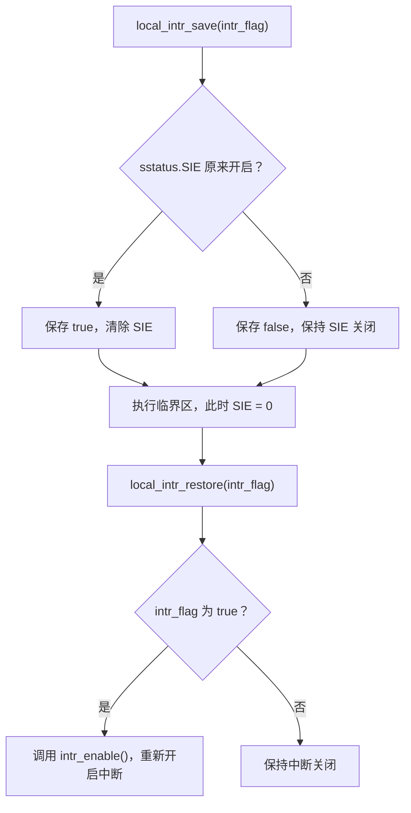

# 操作系统实验报告

## 实验基本信息

| 项目 | 内容 |
|------|------|
| **实验名称** | Lab 4：进程管理 |
| **小组成员** | 学号1-姓名1、学号2-姓名2、学号3-姓名3 |
| **完成日期** | YYYY-MM-DD |

### 小组分工

练习如何分工？

| 成员 | 负责的练习/模块 |
|------|----------------|
| 学号1-姓名1 | [练习或模块名称] |
| 学号2-姓名2 | [练习或模块名称] |
| 2411333-吴卓彦 | 功能模块三：进程调度，Lab 3 Trap 迁移，开关中断 Challenge |

实验报告如何分工？

---

## 一、实验目的

<!-- 说明本次实验的主要目标和预期成果 -->

本实验的主要目的是：

1. [目的1：例如，理解用户态进程如何通过系统调用进入内核]
2. [目的2：例如，掌握进程创建、执行、退出的完整生命周期]
3. [目的3：例如，学习使用 AI 辅助开发操作系统核心功能]

---

## 二、实验环境

你们使用的 AI 工具

| 成员 | AI 编程工具 | 底层模型 | 备注 |
|------|------------|---------|------|
| 学号1-姓名1 | [例如：Cline（VS Code插件） / Claude Code（终端 Agent） / DeepSeek Harness等] | [例如：Claude Sonnet 4.5 / GPT-5.5 / DeepSeek-V4-Flash等] | [可选：特殊配置等] |
| 学号2-姓名2 | | | |
| 学号3-姓名3 | | | |

**说明：**
- **AI 编程工具**：指具体使用的终端工具、编辑器插件、桌面应用或浏览器界面
- **底层模型**：指该工具使用的大语言模型及版本

---

## 三、实验整体逻辑分析

### 2.1 本章节的逻辑主线

[请用自己的话描述本章实验的核心主线，例如：
- 本章围绕哪个核心主题展开？（例如：用户进程管理、虚拟内存、文件系统等）
- 整个实验解决什么问题？（例如：如何让用户程序运行在操作系统之上）]

### 2.2 功能的逐步实现

[说明本章实验是按照什么顺序逐步实现各个功能的，以及为什么要按这个顺序，例如：

1. 首先实现**功能A** → 为什么首先实现这个？（例如：建立系统调用接口是后续所有用户态功能的基础）
2. 接着再完善**功能B** → 为什么接着实现这个？（例如：有了系统调用后，需要能够加载和启动第一个用户进程）
3. 然后完成**功能C** → 为什么然后实现这个？（例如：有了第一个进程后，需要实现进程复制功能）
4. 最后补充了**功能D** → 为什么最后实现这个？（例如：最后完善进程退出和清理机制，形成完整闭环）]

**功能模块二** [2410690-王睿瑜]
1. 用 alloc_proc() 建立 PCB 的基础状态，为启动线程和普通新线程共用。
2. 依据 kernel_thread_entry 和 Trap 恢复代码，确定首次运行需要的函数地址、参数、栈指针和入口地址。
3. 用 do_fork() 串联 PCB 分配、内核栈分配、地址空间接口、现场准备和 PID 登记，最后唤醒新线程。
4. 在 proc_init() 中初始化全局数据结构，把 idleproc 设为 current，然后调用 kernel_thread() 创建 initproc，交给后续调度。

**功能模块三（2411333-吴卓彦）**

1. **触发调度。** `proc_init()` 完成线程初始化后，`cpu_idle()` 检查 `need_resched`，置位时调用 `schedule()`。
2. **选择线程。** `schedule()` 沿进程链表查找就绪线程，选定下一次运行的线程。
3. **切换现场。** `proc_run()` 更新 `current` 和页表，`switch_to()` 保存旧线程的寄存器并恢复新线程的寄存器。
4. **首次运行。** `initproc` 经 `forkret → forkrets → __trapret → kernel_thread_entry` 进入 `init_main()`。

---

## 四、实验内容与实现

<!-- 
说明：本部分按照 exercises 文档中的练习顺序组织
每个功能模块或者练习中可能包含多项任务，请根据实际情况调整
-->

### 功能模块一：虚拟内存页操作

**负责人：** 2413497-姚嘉乐

#### 模块功能描述

**需要实现的函数**

```c
int page_insert(pde_t *pgdir, struct Page *page, uintptr_t la, uint32_t perm);
void page_remove(pde_t *pgdir, uintptr_t la);
```

**所在文件** `code/kern/mm/pmm.c` 中的 `LAB4 function1`。

**功能说明**

两个函数都通过 `get_pte()` 找到 `la` 对应的末级页表项。插入时允许创建缺少的下级页表。末级项为空时给目标物理页增加一次引用，原来就指向同一页时只更新权限，原来指向另一页时先撤销旧映射。最后根据物理页号和本次传入的权限重新构造页表项，再刷新该地址的 TLB。重新构造页表项可以清除本次撤销的权限位。

删除时只查找已有的页表路径。找到有效映射后，`page_remove_pte()` 先记下旧物理页，再清空页表项并刷新 TLB，最后将旧页的引用计数减一，当页引用为0时将它归还给分配器。

```text
page_insert → get_pte(..., 1) → 必要时调用 page_remove_pte()
            → pte_create() → 写入页表项 → tlb_invalidate()
page_remove → get_pte(..., 0) → 末级项有效时调用 page_remove_pte()
```

#### 最终提示词

以下为实际使用的完整最终提示词。

```text
[PROMPT]
任务：
在code/kern/mm/pmm.c中实现 page_insert() 和 page_remove()，用于建立、替换和撤销 Sv39 的 4 KiB 页映射。

操作要求：
在工作区的实际源码中补全 //LAB4 function1 YOUR CODE 所在区域，将标记改为 //LAB4 function1 2413497。编辑范围限于该区域，沿用现有函数声明、页表查找逻辑和物理页分配器。需要共用的辅助函数可以定义为本文件的 static 函数。

输出要求：
直接进行文件操作，使用下面[RELY]、[GUARANTEE]、 [SPECIFICATION]部分的信息。积极合理的使用注释，维护代码的可读性。

[RELY]
请先阅读code/kern/mm/pmm.c和code/kern/mm/pmm.h。

- 查找页表项。get_pte(pgdir, la, 1) 可以创建缺少的下级页表，传 0 则只查找。
  返回 NULL 表示没找到末级项。返回指针时，用 *ptep & PTE_V 判断该项是否有效。
  只读查询也可以用 get_page()，它返回已映射的物理页描述符，并可通过ptep_store 输出末级页表项的地址。
- 读写映射。用 pte_create(page2ppn(page), perm) 构造新页表项，它会设置 PTE_V。用 pte2page(*ptep) 取得有效页表项对应的旧页。
- 管理物理页。page_ref_inc() 和 page_ref_dec() 更新引用计数。
  page_ref_dec() 返回减一后的计数，free_page() 将一页归还分配器。
- 修改末级页表项后，调用 tlb_invalidate(pgdir, la)。
- 常量。PTE_V 定义在 mmu.h，E_NO_MEM 定义在 error.h。

[GUARANTEE]

实现以下两个公开接口，签名与 pmm.h 一致。

int page_insert(pde_t *pgdir, struct Page *page, uintptr_t la, uint32_t perm);
void page_remove(pde_t *pgdir, uintptr_t la);

[SPECIFICATION]

实现单元一  page_insert()

Pre-Condition
物理内存管理已初始化。pgdir 指向有效的 Sv39 根页表。la 位于可使用末级页表项的 4 KiB 映射范围内。page 是已分配或已被其他地址映射的物理页。

Post-Condition
成功时返回 0。目标虚拟页指向 page，页表项按传入的 perm 构造。被撤销的旧映射及其引用计数得到正确处理。

Case 1  末级项原本为空
建立映射，目标物理页的引用计数增加一次。

Case 2  原映射指向同一物理页
更新页表项的权限。物理页号、引用计数和空闲页数保持原值。

Case 3  原映射指向另一物理页
新页增加一次引用，旧页减少一次引用。旧页仍有引用时继续保留，归零时归还分配器。

Case 4  无法分配所需的页表页
返回 -E_NO_MEM。目标数据页的映射和引用计数均未改变，调用者仍负责传入的 page。get_pte() 已挂接的上层页表沿用框架的管理方式。

Requirements
每次成功写入末级项后，同步该虚拟地址的 TLB。回收旧页前，确保旧页表项和旧翻译均已失效。权限按 perm 重新构造，旧权限中被撤销的位应清除。

实现单元二  page_remove()

Pre-Condition
pgdir 指向有效的 Sv39 根页表。la 位于可使用末级页表项的 4 KiB 映射范围内，目标映射可以存在或缺失。

Post-Condition
目标虚拟页的映射被撤销。其他虚拟页的映射和上层页表页继续有效。

Case 1  页表路径缺失或末级项无效
直接返回，页表、引用计数和空闲页数保持原值。对同一地址重复删除也应满足这个行为。

Case 2  末级项有效
先取得旧物理页，再清空末级项并同步该地址的 TLB。旧页引用减少一次，计数归零时调用 free_page()。
```

#### 实现迭代过程

使用这版提示词完成实现后，验证后确认实现正确，没有出现问题。

---

### 功能模块二：[进程创建及初始化]

**负责人：** [2410690-王睿瑜]

#### 模块功能描述

**需要实现/修改的函数：**

修改文件为 code/kern/process/proc.c，对应框架中的 LAB4 function2。本模块实现以下函数。

```c
// 列出本模块涉及的所有函数签名
static struct proc_struct *alloc_proc(void);
int kernel_thread(int (*fn)(void *), void *arg, uint32_t clone_flags);
static void copy_thread(struct proc_struct *proc, uintptr_t stack,
                        struct trapframe *tf);
static int copy_mm(uint32_t clone_flags, struct proc_struct *proc);
int do_fork(uint32_t clone_flags, uintptr_t stack, struct trapframe *tf);
void proc_init(void);
```

**功能说明：**

本模块负责内核线程的创建与初始化，为调度器提供可运行的线程。系统启动时，`proc_init()` 将当前执行现场登记为 `idleproc`，使其复用启动栈并成为当前线程，再通过 `kernel_thread()` 创建执行 `init_main()` 的 `initproc`。

创建新线程时，`do_fork()` 分配进程控制块（PCB）和内核栈，准备首次运行所需的 Trap 帧与切换上下文，再分配 PID，将线程登记到进程链表和 PID 哈希表，并置为就绪态。如果创建过程中发生错误，函数返回相应错误码，并释放已经分配的资源。

本模块调用内存管理模块的接口分配 PCB 和内核栈，创建的内核线程共享启动页表。调度模块选中新线程后，通过 `switch_to()` 恢复切换上下文，从 `forkret()` 进入 Trap 恢复流程，最终执行创建时指定的线程函数。

#### 最终提示词

以下是经过迭代优化后，最终成功实现该功能的提示词：

````markdown

[TASK]
基于小组 Lab4 框架，协助我逐步完成 code/kern/process/proc.c 的 LAB4 function2。
先核对实际源码和函数依赖，再按 PCB 初始化、首次运行现场、创建与登记、启动初始化的顺序给出实现。


[RELY]
以 proc.h 的 proc_struct 和 context、trap.h 的 trapframe 和 pushregs 为准。
依据 entry.S 确认 s0 保存线程函数地址，s1 保存参数。依据 trapentry.S 确认
forkrets 将 sp 指向传入的 Trap 帧，随后通过 __trapret 恢复现场并执行 sret。
使用框架已有的 boot_pgdir_pa、bootstack、KSTACKSIZE、CLONE_VM、
setup_kstack、put_kstack、get_pid、hash_proc、wakeup_proc 和中断保存/恢复接口。
从 riscv.h 使用 read_csr 和 SSTATUS 位定义。

[SPECIFICATION]
实现 alloc_proc、kernel_thread、copy_thread、copy_mm、do_fork 和 proc_init。
新 PCB 处于 PROC_UNINIT，PID 为 -1，使用启动页表。新线程的 Trap 帧位于
自己的内核栈上，首次切换进入 forkret。当前阶段保留 copy_mm 接口。
分配失败时返回负错误码并释放已取得的资源。PID 分配、登记和计数更新置于
同一个关中断区间，登记完成后再唤醒。先将 idleproc 设为 current，再创建 initproc。
给出逐步验证方法。若整机构建受其他模块阻塞，先用 Makefile 单独编译 proc.o，
并根据实际终端输出记录验证状态。

````

#### 实现迭代过程

本模块的实现经历了 [3] 次迭代，过程如下：

---

##### 第一次迭代

**遇到的问题：**
最初按 alloc_proc() 的函数签名搜索源码，终端没有返回结果。查看完整的 proc.c 后发现，框架只提供了 LAB4 function2 YOUR CODE 标记，需要在该位置新增函数。

**问题解决策略：**
在提示词的 [RELY] 中补充实际的 proc.c 和 proc.h，明确以 LAB4 function2 标记定位实现区域。根据 proc_struct 的实际字段编写 alloc_proc()，并核对 boot_pgdir_pa 和 list_init() 的声明后再初始化 PCB。

##### 第二次迭代

**遇到的问题：**
1. 仅看 C 语言接口，无法确定新线程首次运行时，函数地址和参数应放在哪些寄存器里。

2. 审查 set_proc_name() 时发现，它会从传入地址固定复制 PROC_NAME_LEN 个字节。直接传入 "idle" 或 "init" 会读出字符串字面量的边界。

**问题解决策略：**
1. 在 [RELY] 中补充 entry.S、trapentry.S 和 trap.h。根据 move a0, s1 和 jalr s0，在 kernel_thread() 中将函数地址存入 s0、参数存入 s1。在 copy_thread() 中把 Trap 帧复制到新线程的内核栈，并将切换上下文的返回地址设为 forkret。

2. 在 [SPECIFICATION] 中明确线程名称按实际字符串长度复制，并包含结尾的 \0。在 proc_init() 中分别使用 sizeof("idle") 和 sizeof("init") 作为复制长度。

##### 第三次迭代

**遇到的问题：**
1. 执行 make -C code 时，编译在 kern/trap/trap.c 处中止。trap() 调用 interrupt_handler() 和 exception_handler() 时，编译器在调用处看不到这两个函数的声明。整机构建尚未编译到 proc.c。

**问题解决策略：**
1. 在提示词中补充验证步骤。整机构建受其他模块阻塞时，先通过项目 Makefile 单独构建 B 模块，再用 -B 强制重新编译，确认结果来自本次构建。实际执行了 make -B -C code obj/kern/process/proc.o，编译通过。


**最终结果：**

经过 [3] 次迭代，该模块最终：
- ✅ 完成 alloc_proc()、kernel_thread()、copy_thread()、copy_mm()、do_fork() 和 proc_init() 的实现。
- ✅ git diff --check 检查通过，proc.c 单独编译及强制重新编译均通过。
- ✅ 代码已推送至 lab4-wangruiyu 分支，提交号为 058c72e。
- ⏳ initproc 首次运行、资源分配失败后的清理以及整机评分仍待实测。

**关键改进点总结（如有）：**
1. 在 [RELY] 中补充实际的源码标记、数据结构和汇编入口，明确 C 代码与汇编之间的寄存器约定。
2. 在 [SPECIFICATION] 中明确 Trap 帧的位置、线程名称的复制长度，以及 do_fork() 在不同失败阶段需要释放的资源。
3. 通过 Makefile 单独验证 proc.o，并将首次运行和失败清理保留为后续的运行验收项。


### 功能模块三：进程调度

**负责人：** 2411333-吴卓彦

#### 模块功能描述

| 函数 | 实现与边界条件 |
| --- | --- |
| `cpu_idle()` | 在 `proc.c` 中循环检查 `current->need_resched`，标记置位才调用调度器。 |
| `schedule()` | 在 `sched.c` 中保存本地中断状态，清除当前线程的调度标记。当前是 idle 时从链表头之后开始，否则从当前线程之后开始，绕回时跳过哨兵和非就绪节点。找不到可运行的普通线程时选 `idleproc`。选中者的 `runs` 加一，目标与当前不同时才切换。 |
| `proc_run()` | 在 `proc.c` 中更新 `current`，将目标页表根的物理页号与 Sv39 模式位组合后写入 `satp`，刷新 TLB，再调用 `switch_to()`。切出的线程以后恢复执行时，从原调用位置继续，并恢复进入临界区前保存的中断状态。 |
| `switch_to()` | 在 `switch.S` 中按 `struct context` 的顺序保存、恢复 `ra`、`sp` 和 `s0`～`s11`。恢复 `ra` 后返回，新线程从预设的 `forkret` 开始，已运行过的线程回到上次切出的位置。 |

首次运行还需要此前迁移的 Trap 恢复代码。`forkrets` 把 `sp` 指向新线程的 trapframe，`RESTORE_ALL` 恢复寄存器和 CSR，最后由 `sret` 跳到 `kernel_thread_entry`。

Lab 3 的时钟处理中保留重设下一次事件、累加 `ticks` 和每 100 ticks 输出，移除了当时我自己加入的**累计 300 ticks 主动关机**的规则。

#### 最终提示词

我先把调度的输入、修改边界、链表绕回和 idle 回退等要求写成 Spec，再按 `[PROMPT]`、`[RELY]`、`[GUARANTEE]`、`[SPECIFICATION]` 组织独立提示词。四个函数分别列出前置条件和后置条件。

```text
[PROMPT]

**任务**

在项目 `E:\大三上\OS\OS2026_Labs` 的 `Lab4` 分支上实现 uCore 的进程调度。目标平台为 RISC-V RV64，分页模式为 Sv39。请先阅读下列依赖，再按规格直接修改项目文件。

**操作要求**

| 允许修改的文件 | 修改范围 |
| --- | --- |
| `code/kern/process/proc.c` | 在 `LAB4 function3` 标记处实现 `cpu_idle` 和 `proc_run`，按需引入框架已有头文件。 |
| `code/kern/schedule/sched.c` | 在 `LAB4 function3` 标记处实现 `schedule`，保留已有的 `wakeup_proc`。 |
| `code/kern/process/switch.S` | 在 `LAB4 function3` 标记处实现并导出 `switch_to`。 |

保留实验标记，`YOUR CODE` 填写学号`2411333`。沿用框架的公共声明和结构体布局。编辑范围限于上表，不修改进程创建代码、Trap 代码、内存管理、构建配置和测试。

**输出要求**

实际修改工作区源码，完成后只说明修改了哪些文件和函数、还有哪些点需要实验者核对。编译、QEMU、评分和截图由实验者完成。请勿在 WSL 编译、运行 QEMU、执行评分或生成测试证据。

[RELY]

- `code/kern/process/proc.h` 和 `code/kern/process/proc.c` 提供 PCB、`struct context`、`current`、`idleproc`、`proc_list` 和 `le2proc`。普通线程通过 `list_link` 登记到进程链表。内核线程的 `pgdir` 是页表根的物理地址。
- `code/kern/schedule/sched.h` 提供调度接口。 `code/libs/list.h` 中的双向循环链表以 `proc_list` 为哨兵。使用 `list_next` 遍历，对普通节点使用 `le2proc(node, list_link)`。
- `code/kern/sync/sync.h` 和 `code/kern/driver/intr.c` 提供本 hart 的中断保存与恢复接口。`local_intr_save` 记录进入前的 `sstatus.SIE` 状态并关中断，`local_intr_restore` 按保存值恢复。
- `code/libs/riscv.h` 提供 CSR 操作、`SATP_MODE_SV39`、`RISCV_PGSHIFT` 和 `REGBYTES`、`LOAD`、`STORE` 等汇编宏。对照 `code/kern/mm/pmm.c` 的 `enable_paging()` 和 `code/kern/mm/pmm.h` 的 `flush_tlb()`。现有 `lsatp()` 适用于 Sv32。
- 新线程的 `context` 和 trapframe 由线程创建代码准备，首次运行沿用 `forkret → forkrets → __trapret → kernel_thread_entry`。

[GUARANTEE]

- 交付 `void cpu_idle(void)`、`void schedule(void)`、`void proc_run(struct proc_struct *proc)`、`void switch_to(struct context *from, struct context *to)` 的实现，保持框架接口可调用。
- 调度覆盖空链表、非就绪节点、绕回、只有当前线程可运行、无可运行普通线程这几种情况。每次调度只计一次 `runs`，选中当前线程时不切换上下文。
- 可运行的新线程能进入已有首跑路径，已经运行过的线程被重新选中时能从原切出位置继续，临界区退出时恢复调用前保存的中断状态。
- 验收由实验者在模块集成后用 `make qemu` 和 `make grade` 完成。检查 `[Test Schedule] PASS` 和 `initproc` 的输出。`code/tools/test_lab4.c` 的调度用例创建两个测试线程并确认两者都实际运行。

[SPECIFICATION]

### 实现单元一 · `cpu_idle(void)`

**Pre-Condition**

- 内核已完成 `proc_init`，`current` 指向有效的 `idleproc`。

**Post-Condition**

- 函数持续运行。仅当 `current->need_resched` 置位时调用 `schedule()`，恢复到空闲线程后继续检查。

### 实现单元二 · `schedule(void)`

**Pre-Condition**

- `proc_list` 已初始化为带哨兵的循环链表。`current`、`idleproc` 有效。若当前是普通线程，它的 `list_link` 已登记在链表中。调用时本地中断可以开启或关闭。

**Post-Condition**

- 保存本地中断状态并关中断，清除调用时当前线程的 `need_resched`。
- 当前是 idle 时从哨兵之后开始，否则从当前线程之后开始。最多扫描一圈，跳过哨兵和非 `PROC_RUNNABLE` 的节点。绕回后可以选中仍然就绪的当前普通线程。找不到可运行普通线程时选择 `idleproc`。
- 选中者的 `runs` 加一。仅当它与 `current` 不同时调用 `proc_run(next)`。本次调用恢复执行并离开临界区时，恢复保存的本地中断状态。

### 实现单元三 · `proc_run(struct proc_struct *proc)`

**Pre-Condition**

- `proc` 和 `current` 都指向有效 PCB。目标的 `pgdir` 是页对齐的物理地址，目标上下文可被恢复。

**Post-Condition**

- 若目标就是 `current`，直接返回，不改写 `satp` 或切换上下文。
- 若目标不同，保存并关闭本地中断，保留旧 `current`，将 `current` 更新为目标。将目标页表根物理地址右移 `RISCV_PGSHIFT` 得到物理页号，与 RV64 Sv39 模式字段组合后写入 `satp`，随后执行 `flush_tlb()`。
- 用旧线程和目标线程的 `context` 地址调用 `switch_to`。旧线程后来恢复执行、从这次调用返回时，恢复它进入临界区前保存的中断状态。

### 实现单元四 · `switch_to(struct context *from, struct context *to)`

**Pre-Condition**

- 按 RISC-V 调用约定，`a0`、`a1` 分别指向可写的旧上下文和已准备好的目标上下文。槽位与 `proc.h` 的 `struct context` 一致，RV64 下每槽 8 字节。

**Post-Condition**

- 将 `ra`、`sp`、`s0`～`s11` 按结构体顺序保存至 `from`，再从 `to` 恢复对应的 14 个槽位。
- 通过恢复后的 `ra` 返回。目标线程首次运行时返回到 `forkret`，已经运行过时回到它上次切出的调用位置。
```

#### 实现迭代过程

1. **前置迁移。** 将 Lab 3 的中断与异常处理、Trap 入口和现场恢复迁入 Lab 4，保留时钟重设、计数和周期输出，去掉固定关机规则。
2. **首次生成。** AI 按 Spec 一轮完成四个调度函数。并且通过静态审查确认调度逻辑和上下文布局符合 Spec。

**最终结果**

- ✅ 完成 `cpu_idle()`、`schedule()`、`proc_run()` 和 `switch_to()`。
- ✅ 补丁格式检查通过，链表选择规则和 14 个上下文槽位已核对。

**关键改进点总结**

1. 在 `[RELY]` 中明确 `struct context` 的寄存器顺序和新线程的首跑路径，便于对照 C 与汇编接口。
2. 在 `[SPECIFICATION]` 中明确链表绕回、idle 回退和选中当前线程时的行为，并说明旧线程恢复执行后何时还原中断状态。


### 练习：[练习标题]

**负责人：** [学号-姓名]

[按照练习的具体要求进行解答]

---

### Challenge 1：本地中断的保存与恢复

**负责人：** 2411333-吴卓彦

#### 题目

说明 `local_intr_save(intr_flag); ... local_intr_restore(intr_flag);` 如何实现开关中断。

#### 解答

这对宏在进入临界区时关闭当前 hart 的 S 态全局中断，并在退出时恢复进入前的状态。`local_intr_save(intr_flag)` 读取 `sstatus.SIE`，将原先的开关状态存入 `intr_flag`。如果中断原本开启，就调用 `intr_disable()` 清除 `SIE`。临界区执行完毕后，`local_intr_restore(intr_flag)` 读取这个保存值。原本开启就调用 `intr_enable()` 重新开启，原本关闭就保持关闭。下图展示了这两种情况。


```mermaid
flowchart TD
    A["local_intr_save(intr_flag)"] --> B{"sstatus.SIE 原来开启？"}
    B -->|"是"| C["保存 true，清除 SIE"]
    B -->|"否"| D["保存 false，保持 SIE 关闭"]
    C --> E["执行临界区，此时 SIE = 0"]
    D --> E
    E --> F["local_intr_restore(intr_flag)"]
    F --> G{"intr_flag 为 true？"}
    G -->|"是"| H["调用 intr_enable()，重新开启中断"]
    G -->|"否"| I["保持中断关闭"]
```

以 `schedule()` 调用 `proc_run()` 为例，假设进入调度前中断开启。

1. `schedule()` 保存 `true` 并关中断，随后选定下一个线程。
2. `proc_run()` 进入内层临界区时中断已关闭，因此保存 `false`。旧线程被再次调度后，从 `switch_to()` 返回，内层恢复操作保持中断关闭。
3. 旧线程继续退出 `schedule()` 的外层临界区，外层按保存的 `true` 重新开启中断。

这样，当前线程、页表和寄存器现场的交接可以在本地关中断期间完成。该机制保护当前 hart 的临界区。多核共享数据还需要相应的同步机制。

### Challenge 2：深入理解不同分页模式的工作原理（思考题）

**负责人：** 2413497-姚嘉乐

#### 题目

1. 结合 Sv32、Sv39、Sv48 的异同，解释 `get_pte()` 中的两段代码为什么相像。
2. `get_pte()` 把页表项查找和页表页分配放在同一个函数里。这种写法是否合适，有没有必要把两个功能拆开？

#### 解答

**1. 两段代码的作用**

Lab4 使用 Sv39。`get_pte()` 的第一段用 `PDX1(la)` 选出根页表项，从该项找到中间页表。第二段用 `PDX0(la)` 选出中间页表项，再从该项找到末级页表。两段跨越的是不同层级，但执行的是同一种操作：检查当前项的 `PTE_V` 位。如果下一级页表缺失且允许创建，就分配并清零一页，再把新页的物理页号写入当前项。到达末级页表后，`get_pte()` 用 `PTX(la)` 选中目标项并返回它的地址。

三种模式都把虚拟地址拆成各级索引和页内偏移。查找 4 KiB 页时，最低 12 位都是页内偏移，每级索引用来选择当前页表中的一项。

| 分页模式 | 各级索引位数 | 页表层数 | 查找 4 KiB 页时向下走的次数 |
| --- | --- | ---: | ---: |
| Sv32 | 10 + 10 | 2 | 1 |
| Sv39 | 9 + 9 + 9 | 3 | 2 |
| Sv48 | 9 + 9 + 9 + 9 | 4 | 3 |

每多一级页表，就要再执行一次查找下级页表的操作。按 Lab4 的写法，Sv32 只需写一段这样的检查，Sv39 需要写两段，Sv48 则需要写三段。两段代码相像，正是因为它们重复了同一个逐级查找步骤。

**2. 查找与分配是否需要拆开**

我认为本实验保留现有写法即可。查找和按需分配走同一条页表路径，`create` 决定缺少下级页表时如何处理。`page_remove()` 传入 `0`，缺表时直接返回。`page_insert()` 传入 `1`，遇到缺表才尝试分配。两个调用方因此可以共用一套遍历代码。

如果后续需要区分缺表和内存不足，或要求分配失败时撤销本次已挂接的页表等操作，可以提供「只查找」和「查找或创建」两个接口，内部仍共用遍历代码。

---

## 五、测试与验证

我们在 WSL 的 `code` 目录执行了 `make qemu` 和 `make grade`。普通启动完成了内存自检，`initproc` 成功运行。课程评分的三项测试全部通过，总分为 **30/30**。

### 普通启动与内核线程运行


前两张图记录了内核的编译与链接过程。编译时，`kmalloc.c` 把整数形式的地址传给了接收 `void *` 的 `kva2page()`，因此出现类型转换警告。我们查阅了对应源码和构建选项，确认该警告未中断本次编译。`removing unused section` 是链接器按构建选项移除未使用段时打印的信息。链接完成后，`objcopy` 生成了内核镜像 `bin/ucore.img`。


启动后，内核从设备树中读到了 128 MiB 物理内存。随后，物理页分配自检 `check_alloc_page()`、页表自检 `check_pgdir()` 和启动页表自检 `check_boot_pgdir()` 均通过。`initproc` 以 PID 1 运行，打印了 `Hello world!!` 和结束语，验证了内核线程的创建和首次切换。

### 课程评分


`make grade` 在临时副本中注入课程测试。除上述地址转换警告外，评分代码把返回 `void` 的测试函数传给了要求返回 `int` 的 `kernel_thread()`，因此出现函数指针类型警告。我们对照测试代码和接口声明后确认，这些编译警告未中断本次构建和评分,和我们的代码实现是否正确无关。


评分输出中，`check PMM`、`check Process Create` 和 `check Schedule` 均为 `OK`，每项满分 10 分。三项结果分别验证了页映射与引用计数、内核线程创建，以及两个测试线程都能得到调度并实际运行。

---

## 六、实验总结与收获

### 对操作系统的理解

1. **PCB 与状态转换。** `proc_struct` 保存 PID、状态、内核栈和上下文等信息。新 PCB 从 `PROC_UNINIT` 开始，由 `wakeup_proc()` 置为 `PROC_RUNNABLE`，后续由调度器选择。
2. **线程资源共享。** 两个内核线程可以共享内核地址空间，同时保有各自的 PCB 和栈。`idleproc` 复用启动栈，`initproc` 使用单独分配的内核栈。
3. **切换上下文与 Trap 返回。** `context` 用于恢复内核切换所需的寄存器，`trapframe` 用于恢复 Trap 返回现场。首次运行通过预先构造这两份状态，把新线程送到指定入口。
4. **进程标识和并发保护。** PID 分配和链表、哈希表登记在同一段本地关中断区间内完成，防止本 CPU 的中断路径在登记过程中观察到不一致状态。
5. **调度策略与执行现场。** `schedule()` 按就绪状态和链表顺序选线程，`proc_run()` 和 `switch_to()` 完成执行权交接。实验中的测试线程主动让出 CPU，可以验证多次切出和恢复。
6. **本地中断与原子性。** 调度过程中保存并关闭当前 hart 的中断，使当前线程、地址翻译和寄存器现场在交接过程中保持一致。
7. **本实验未覆盖的调度机制。** 实验用链表扫描和主动重调度展示线程切换。完整的时间片抢占、优先级调度、多核运行队列和负载均衡还需要额外机制。

### AI 协作开发的经验


---
